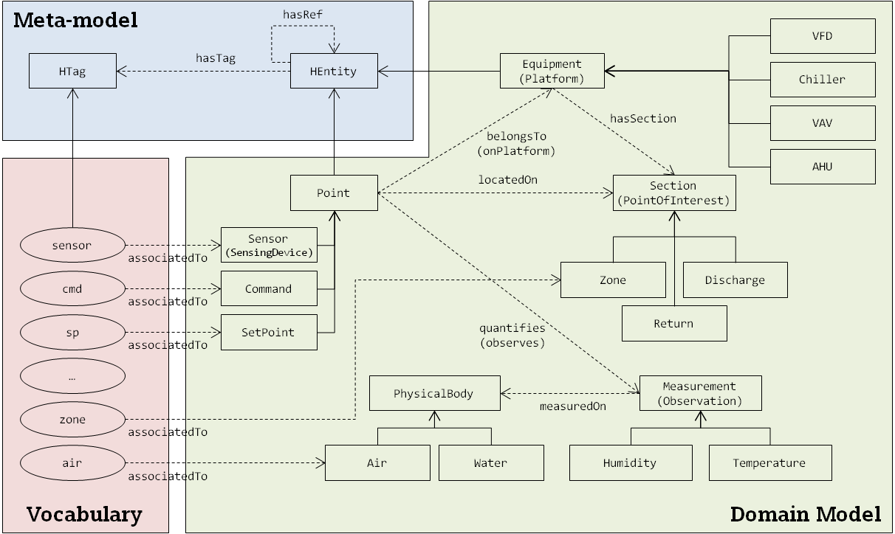

---
title:
layout: default
---
### HTO

The Haystack Tagging Ontology (HTO) is an OWL ontology for
[Project Haystack](http://project-haystack.org/), a domain vocabulary for
Building Automation Systems.

See the [generated documentation](doc.htm) for the ontology.

### Overview

The ontology is (conceptually) divided into three modules:

- the meta-model, that has been derived from Project Haystack's tag model.
- the vocabulary, consisting of raw Haystack tagged wrapped in a namespace.
  Only markers and refs has been included. For other kinds of tags,
  [existing vocabularies](http://lov.okfn.org/dataset/lov/) should be used
  instead (e.g. [WGS84](http://www.w3.org/2003/01/geo/wgs84_pos),
  [Time Ontology](http://www.w3.org/TR/owl-time/),
  [Quantity Kinds and Units](http://www.w3.org/2005/Incubator/ssn/ssnx/qu/qu-rec20.html),
  etc).
- the domain model, that has been manually derived from Project Haystack's
  [documentation](http://project-haystack.org/doc).

### Usage

Turning Haystack tags into RDF data is quite straightforward: the Haystack
entity becomes a RDF resource. Its URI is used as an ID and `rdfs:label` is
used for a textual description. To a tag or a ref corresponds a triple with
`hto:hasTag` or `hto:hasRef`, respectively. See the example below.

The following tag set (Zinc syntax)

~~~
id: @CHU-1-SWT-1
dis: “CHU-1 Temperature Sensor 1”
sensor
temp
discharge
equipRef: @CHU-1
~~~

is equivalent to the following RDF document (Turtle syntax)

~~~ turtle
@PREFIX rdf  : <http://www.w3.org/1999/02/22-rdf-syntax-ns#>
@PREFIX rdfs : <http://www.w3.org/2000/01/rdf-schema#>
@PREFIX hto  : <http://project-haystack.org/hto#>
@PREFIX      : <http://example.org/>

:CHU-1-SWT-1 rdf:type hto:HEntity;
             rdfs:label "CHU-1 Temperature Sensor 1";
             hto:hasTag hto:sensor;
             hto:hasTag hto:temp;
             hto:hasTag hto:discharge;
             hto:hasRef :CHU-1.
~~~

All tags from the vocabulary have been map to a concept to the domain model
so that a transformation is possible between raw Haystack tags and ontological
data.

_Code for transformation coming soon..._

### Further reading

- V. Charpenay et al., "An Ontology Design Pattern for IoT Device Tagging
Systems," in <i>Internet of Things (IoT), 2015 5th International Conference on
the</i>, Seoul, 2015.
